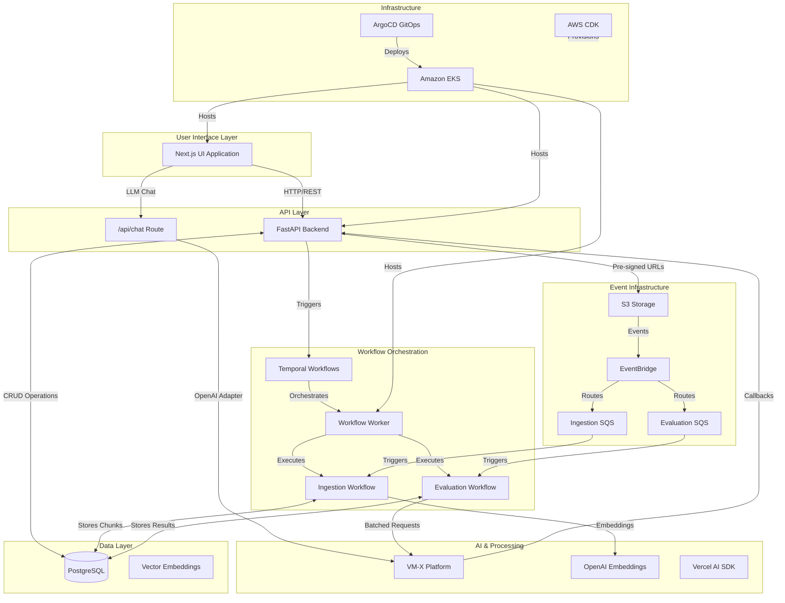
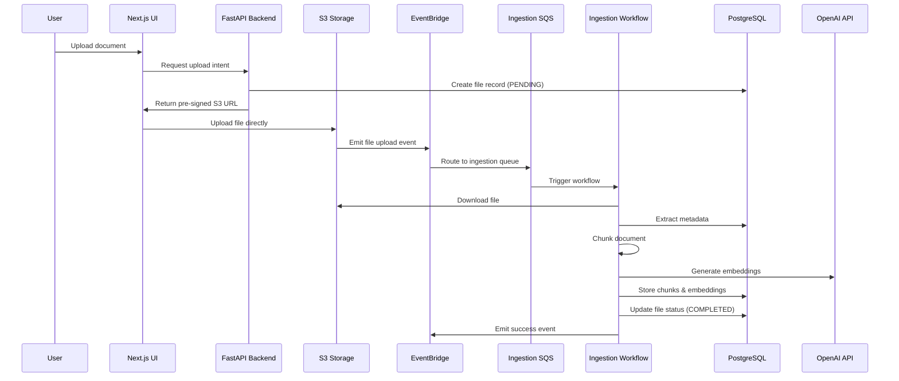
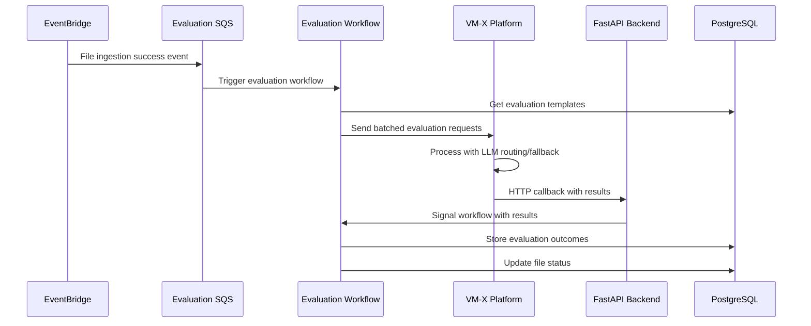

# VM-X AI File Processing

A production-ready, cloud-native Next.js application that serves as the primary interface for the VM-X AI File Processing Platform. This UI enables organizations to upload, process, evaluate, and analyze documents at scale using advanced AI workflows, Temporal orchestration, and VM-X's intelligent routing capabilities.

---

## Project Overview & Business Goals

### What is the VM-X AI File Processing Platform?

The VM-X AI File Processing Platform is a comprehensive, enterprise-grade system designed to automate document ingestion, analysis, and evaluation using Large Language Models (LLMs). The platform transforms unstructured documents into structured, searchable, and actionable insights through a sophisticated pipeline of AI-powered workflows.

### Core Business Value

**For Enterprise Organizations:**

- **Compliance & Audit:** Automatically evaluate documents against regulatory requirements, company policies, and compliance standards
- **Document Classification:** Intelligently categorize and tag large document repositories for improved searchability and organization
- **Content Analysis:** Extract insights, summaries, and structured data from unstructured documents at scale
- **Quality Assurance:** Standardize document evaluation processes with configurable templates and automated workflows

**For Technical Teams:**

- **Scalable AI Infrastructure:** Leverage VM-X's advanced routing, fallback, and batching capabilities for reliable LLM operations
- **Event-Driven Architecture:** Process documents asynchronously with robust error handling and retry mechanisms
- **Audit Trail:** Complete traceability of all document processing and evaluation activities
- **Multi-Tenant Support:** Project-based organization for team collaboration and client separation

---

## Technical Architecture

### System Overview

The UI is the frontend component of a sophisticated, event-driven microservices architecture that spans multiple AWS services, Kubernetes workloads, and AI platforms:



### Technology Stack

**Frontend & UI:**

- **Next.js 15** with React 19 - Server-side rendering and modern React features
- **TypeScript** - Type-safe development with generated API clients
- **Tailwind CSS** - Utility-first styling with custom design system
- **Zustand** - Lightweight state management for project/file context
- **Vercel AI SDK** - Advanced LLM chat and tool calling capabilities
- **Shadcn/UI** - Modern, accessible component library

**Backend Integration:**

- **OpenAPI-Generated Client** - Type-safe API communication with FastAPI backend
- **Server Actions** - Next.js server-side mutations for data operations
- **REST API Integration** - HTTP-based communication with polling for status updates

**Infrastructure & Deployment:**

- **Docker** - Containerized deployment with multi-stage builds
- **Amazon EKS** - Kubernetes orchestration with Auto Mode scaling
- **ArgoCD** - GitOps-based continuous deployment
- **AWS CDK** - Infrastructure as code with TypeScript
- **Istio Service Mesh** - Traffic management and security

---

## End-to-End Document Processing Flow

### 1. File Upload & Ingestion Pipeline



### 2. AI Evaluation & VM-X Integration



---

## Vercel AI & VM-X Integration Deep Dive

### Advanced LLM Chat Interface

The UI implements a sophisticated chat interface that combines the developer experience of Vercel AI SDK with the enterprise capabilities of VM-X:

**Architecture:**

- **Vercel AI SDK** (`ai`, `@ai-sdk/openai`) provides streaming, tool calling, and React hooks
- **VM-X OpenAI Adapter** routes all LLM requests through VM-X for routing, fallback, and monitoring
- **Custom Fetch Implementation** forwards headers and collects VM-X metadata for observability

**Key Features:**

- **Streaming Responses** - Real-time LLM output with token-by-token rendering
- **Tool/Function Calling** - LLM can invoke backend functions to fetch data and perform actions
- **Stateless Chat** - Each conversation is independent with project/file context injected per request
- **Error Handling** - Graceful fallback and retry mechanisms via VM-X
- **Audit Trail** - Complete logging of all LLM interactions and tool usage

### VM-X Integration Benefits

**Enterprise AI Operations:**

- **Intelligent Routing** - Automatic selection of optimal LLM providers based on request characteristics
- **Fallback Mechanisms** - Seamless failover between providers for high availability
- **Cost Optimization** - Dynamic routing based on cost, performance, and quality metrics
- **Security & Compliance** - Centralized access control and audit logging for all AI operations
- **Rate Limiting** - Sophisticated throttling and queuing for large-scale deployments

---

## LLM Tools: Contextual Business Intelligence

### Available Tools

The chat interface exposes powerful tools that enable the LLM to interact with your business data:

| Tool Name                  | Purpose                                 | Business Value                             |
| -------------------------- | --------------------------------------- | ------------------------------------------ |
| `list_files`               | List available files in project         | Project overview and file discovery        |
| `similarity_search`        | Semantic search across document content | Knowledge retrieval and question answering |
| `read_file`                | Access specific file content by page    | Detailed document analysis                 |
| `read_file_evaluations`    | Get evaluation results for files        | Quality assurance and compliance reporting |
| `list_evaluations`         | Browse all project evaluations          | Workflow monitoring and analytics          |
| `list_files_by_evaluation` | Find files by evaluation criteria       | Compliance auditing and categorization     |

### Example Business Workflows

**Compliance Officer:**

```
"Show me all files that failed GDPR compliance evaluation"
→ LLM uses list_evaluations + list_files_by_evaluation + similarity_search
→ Returns comprehensive compliance report with specific violations
```

**Document Analyst:**

```
"Summarize the key risks mentioned in contract files from Q4"
→ LLM uses list_files + similarity_search + read_file
→ Provides risk analysis with source citations
```

**Quality Manager:**

```
"Which documents need re-evaluation after our policy update?"
→ LLM uses list_evaluations + read_file_evaluations
→ Identifies outdated evaluations requiring updates
```

---

## Security & Compliance

### Security Features

**Authentication & Authorization:**

- VM-X credentials managed via AWS Secrets Manager
- Kubernetes service accounts with least-privilege IAM roles
- Secure secret injection via Secrets Store CSI driver

**Data Protection:**

- Direct S3 uploads with pre-signed URLs (no server transit)
- TLS encryption for all API communications
- KMS encryption for sensitive data at rest

**Audit & Compliance:**

- Complete audit trail of all user actions
- LLM interaction logging for compliance reviews
- Project-based data isolation for multi-tenant scenarios

### Infrastructure Security

**Kubernetes Security:**

- Pod Security Standards enforcement
- Network policies for traffic isolation
- Regular security scanning and updates

**AWS Security:**

- VPC with private subnets for compute resources
- Security groups with minimal required access
- CloudTrail logging for all infrastructure changes

---

## Monitoring & Observability

### Application Metrics

**Performance Monitoring:**

- Next.js performance metrics and Core Web Vitals
- API response time and error rate tracking
- LLM request latency and success rates

**Business Metrics:**

- File upload and processing success rates
- Evaluation completion times and accuracy
- User engagement and feature adoption

### Infrastructure Monitoring

**EKS Cluster:**

- Pod resource utilization and scaling metrics
- Service mesh traffic patterns and latency
- Application logs aggregated via CloudWatch

**AWS Services:**

- S3 storage usage and access patterns
- EventBridge event processing metrics
- SQS queue depth and processing rates

---

This application serves as the primary interface for a sophisticated, enterprise-grade AI document processing platform, enabling organizations to harness the power of Large Language Models for document analysis, compliance, and business intelligence at scale.

---

## Run Your Own

This project is designed to help developers by encapsulating the golden patterns, best practices, and lessons we've learned over years of building scalable, cloud-native AI document processing systems. By bringing together multiple learning initiatives, challenges, and experiments, we aim to provide a production-ready platform that not only solves real-world problems but also serves as a reference for robust architecture and development workflows.

You can run the entire stack locally by following the [local setup guide](./docs/run-locally.md).

## More Information

This project is a monorepo that contains multiple projects, you can find more detailed information about each project.

### UI

- [UI](packages/apps/ui/README.md)

### Backend

- [API](packages/apps/api/README.md)

### Workflows

- [Workflow Worker](packages/workflows/worker/README.md)
- [Ingestion Workflow](packages/workflows/ingestion/README.md)
- [Evaluation Workflow](packages/workflows/evaluation/README.md)

### Infrastructure

- [Network](packages/infra/network/README.md)
- [Database](packages/infra/database/README.md)
- [Event Bridge](packages/infra/event/README.md)
- [EKS Kubernetes](packages/infra/eks/README.md)
- [ECR](packages/infra/ecr/README.md)

### DevOps

- [GitHub Actions AWS Integration](packages/infra/github-actions/README.md)
- [ArgoCD](packages/infra/argocd/README.md)

### Libraries

#### Infra

- [CDK Shared Library](packages/infra/cdk/shared/README.md)

#### Workflow

- [Temporal](packages/libs/py/temporal/utils/README.md)
- [Shared Activities](packages/workflows/shared-activities/README.md)

#### Application

- [Python Utils](packages/libs/py/utils/README.md)
- [Python Logger](packages/libs/py/logger/README.md)
- [Python AWS SQS Consumer](packages/libs/py/aws/sqs-consumer/README.md)
- [Python Shared Schemas](packages/libs/py/schemas/README.md)
- [Shared Services](packages/libs/py/services/README.md)

##### Data Access

- [DB Models](packages/libs/py/db/models/README.md)
- [DB Repositories](packages/libs/py/db/repositories/README.md)
- [DB Services](packages/libs/py/db/services/README.md)

## Roadmap & Future Enhancements

### Short Term (Q1-Q2)

- **User Authentication & RBAC** - Multi-tenant user management with role-based access
- **API Rate Limiting** - Intelligent throttling for large-scale deployments
- **Conversation Memory** - Persistent chat history with project/file context for improved user experience
- **WebSocket Support** - Real-time updates for workflow status and results

### Medium Term (Q3-Q4)

- **Custom Evaluation Pipelines** - Visual workflow builder for complex evaluation logic
- **Multi-Language Support** - Internationalization for global deployments
- **Advanced Search & Filtering** - Elasticsearch integration for powerful document discovery
- **Workflow Templates** - Pre-built evaluation templates for common use cases

### Long Term (2025+)

- **AI-Powered Insights** - Automatic pattern detection and anomaly identification
- **Third-Party Integrations** - Connectors for SharePoint, Google Drive, and other document sources
- **Real-Time Collaboration** - Multi-user editing and commenting on evaluations
- **Advanced Security Features** - Zero-trust architecture and advanced threat detection

---
