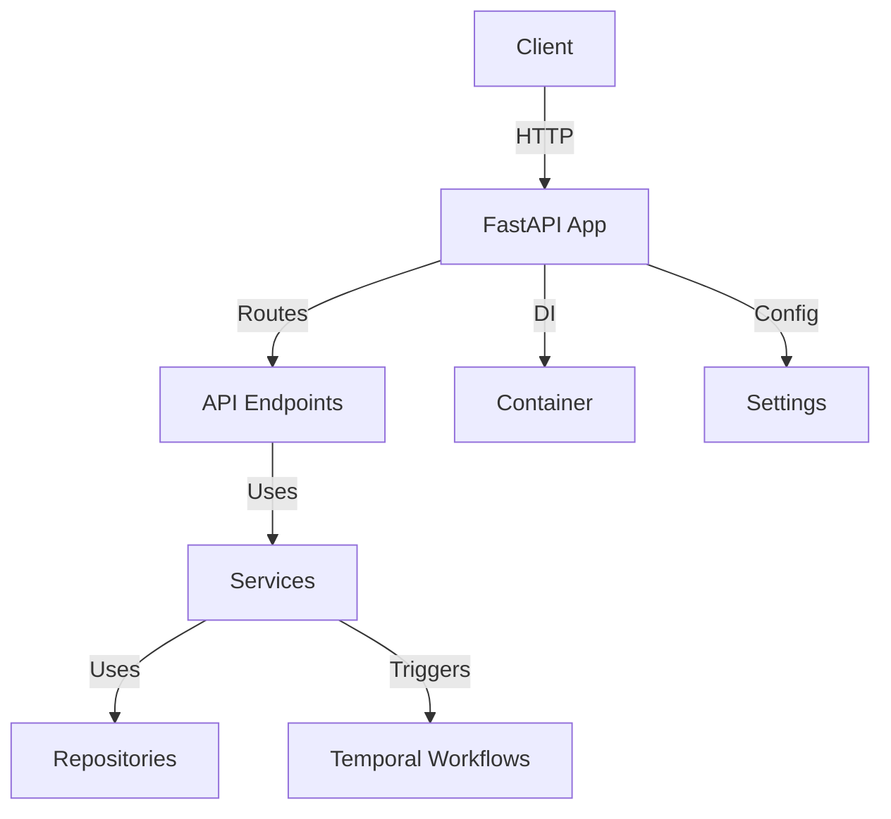
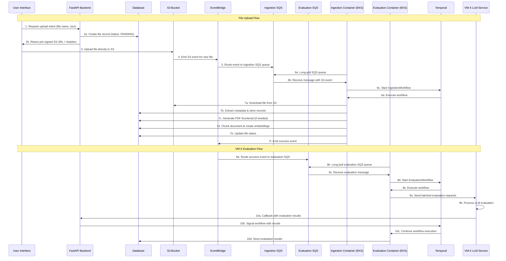

# API Application

A FastAPI-based backend application providing a robust, async HTTP API for managing projects, files, evaluations, and workflow orchestration. Integrates with modular services, repositories, and Temporal workflows for scalable, type-safe data and workflow management.

## Key Features & Benefits

- **Async FastAPI:** High-performance, async HTTP API for workflow and data management
- **Modular Routing:** Organized endpoints for projects, files, evaluations, and more
- **Dependency Injection:** All services, repositories, and clients are injected via DI containers
- **Workflow Integration:** Triggers and manages Temporal workflows from API endpoints
- **Configurable:** Uses Pydantic-based settings loaded from environment variables

## Architecture Overview

- **FastAPI App:** Handles HTTP requests and routing
- **DI Container:** Wires all dependencies (settings, services, repositories, clients)
- **Settings:** Pydantic-based, environment-driven configuration

## End-to-End File Upload, Ingestion, and Evaluation Flow

### 1. File Upload Flow

1. **User uploads a file via the UI.**
   - The UI calls the API endpoint to request an upload intent with the file name and size.
2. **API generates a pre-signed S3 upload URL.**
   - The API creates a new file record in the database (status: PENDING).
   - It returns a pre-signed S3 URL and headers to the client.
3. **Client uploads the file directly to S3.**
   - The file is stored in the S3 bucket.
4. **S3 emits an event for the new file.**
   - The S3 event is routed to AWS EventBridge.
5. **EventBridge delivers the event to an SQS queue.**
   - An EventBridge rule targets the SQS queue for ingestion.
6. **Ingestion workflow container (on EKS) long-polls the SQS queue.**
   - When a message is received, the container starts the `IngestionWorkflow` via the Temporal API, passing the S3 event payload.
7. **Ingestion workflow processes the file:**
   - Downloads the file from S3, extracts metadata, stores file/content records, generates a PDF thumbnail if needed.
   - Chunks the document, creates embeddings, updates file status, and emits a success event to EventBridge for downstream systems (e.g., evaluation).

### 2. VM-X Ingestion Callback & Evaluation Flow

1. **Evaluation workflow is triggered by the success event.**
   - EventBridge rule targets the evaluation SQS queue.
   - Evaluation workflow container long-polls the queue and starts the `EvaluationWorkflow` via Temporal.
2. **Evaluation workflow sends requests to VM-X for LLM processing.**
   - Batches evaluation requests and sends them to VM-X.
3. **VM-X processes the batch and issues a callback.**
   - When a batch item is completed, VM-X calls the API callback endpoint with the result payload.
4. **API signals the Temporal workflow.**
   - The API locates the Temporal workflow and signals it with the evaluation result, allowing the workflow to continue or update state.

## Dependency Injection & Configuration

- **Container:** Combines repositories, services, Temporal client, and settings as singletons/factories
- **Settings:** All configuration (e.g., OpenAI, S3, Temporal) is loaded via Pydantic settings classes
- **Session Management:** Provides singleton aioboto3 session for AWS integrations

## Directory Structure

| Path                | Purpose                     |
| ------------------- | --------------------------- |
| `api/`              | Main API source code        |
| `api/routes/`       | API endpoint route handlers |
| `api/settings.py`   | App configuration           |
| `api/containers.py` | DI container setup          |
| `tests/`            | (Placeholder) for tests     |

## Main Endpoints Overview

| Path/Route                                                               | Method(s)        | Description                       |
| ------------------------------------------------------------------------ | ---------------- | --------------------------------- |
| `/projects`                                                              | GET, POST        | List/create projects              |
| `/projects/{project_id}`                                                 | GET, PUT, DELETE | Get/update/delete a project       |
| `/projects/{project_id}/files`                                           | GET              | List files in a project           |
| `/projects/{project_id}/file/{file_id}`                                  | GET, DELETE      | Get/delete a file                 |
| `/projects/{project_id}/file/{file_id}/content`                          | GET              | Get file content                  |
| `/projects/{project_id}/file/{file_id}/evaluations`                      | GET              | List file evaluations             |
| `/projects/{project_id}/files/search`                                    | POST             | Search files in a project         |
| `/projects/{project_id}/evaluations`                                     | GET, POST        | List/create evaluations           |
| `/projects/{project_id}/evaluations/tree`                                | GET              | Get evaluation tree               |
| `/projects/{project_id}/evaluation/{evaluation_id}/files`                | GET              | Files for an evaluation           |
| `/projects/{project_id}/evaluations/{evaluation_id}`                     | PUT, DELETE      | Update/delete evaluation          |
| `/projects/{project_id}/evaluation-categories`                           | GET, POST        | List/create evaluation categories |
| `/projects/{project_id}/evaluation-categories/{category_id}`             | PUT, DELETE      | Update/delete category            |
| `/projects/{project_id}/evaluation-categories/{category_id}/evaluations` | GET              | Evaluations by category           |
| `/projects/{project_id}/evaluation/{evaluation_id}/files`                | GET              | Files for an evaluation           |
| `/projects/{project_id}/file/{file_id}/evaluations`                      | GET              | Evaluations for a file            |
| `/projects/{project_id}/files/search`                                    | POST             | Search files                      |
