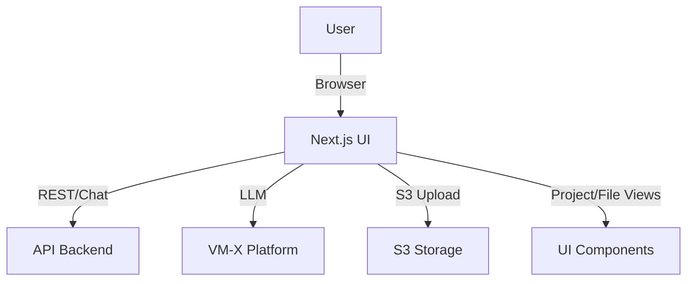
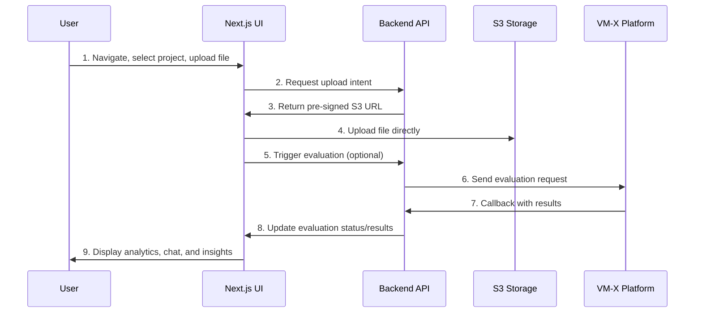

# UI Application

A Next.js-based frontend application providing a modern, interactive interface for managing projects, files, evaluations, and AI-powered workflows. Integrates with the VM-X platform and backend API for seamless document processing, evaluation, and analysis.

## Key Features & Benefits

- **Modern Next.js UI:** Fast, responsive, and accessible web interface
- **Project & File Management:** Organize, upload, and browse documents by project
- **AI-Powered Evaluation:** Trigger and view LLM-based evaluations and analytics
- **Chat & Exploration:** Conversational interface for querying and exploring documents
- **Seamless Integration:** Works with FastAPI backend and VM-X platform for end-to-end workflows
- **Configurable & Extensible:** Built with TypeScript, Tailwind CSS, and modular components

## Architecture Overview

- **Next.js UI:** Handles all user interactions, routing, and state
- **API Backend:** Provides data, upload intents, and evaluation results
- **VM-X Platform:** Processes LLM requests and evaluations
- **S3 Storage:** Stores uploaded files
- **UI Components:** Modular, reusable React components for all features

## End-to-End User Flow

### 1. File Upload & Management

- Users select a project and upload files via the UI
- UI requests a pre-signed S3 URL from the API, then uploads directly

### 2. Evaluation & Analysis

- Users can trigger AI-powered evaluations on files
- Results and analytics are displayed in the UI
- Chat interface allows querying and exploration of project data

## Directory Structure

| Path              | Purpose                          |
| ----------------- | -------------------------------- |
| `src/app/`        | Next.js app routes and pages     |
| `src/components/` | UI and business logic components |
| `src/hooks/`      | Custom React hooks               |
| `src/store/`      | Zustand state management         |
| `src/utils/`      | Utility functions                |
| `src/types/`      | TypeScript types                 |
| `public/`         | Static assets                    |
| `infra/`          | Infrastructure as code (CDK)     |

## Main UI Routes & Components

| Route/Component                               | Description                        |
| --------------------------------------------- | ---------------------------------- |
| `/`                                           | Dashboard, project overview        |
| `/project/[projectId]`                        | Project details, file list         |
| `/project/[projectId]/files/[fileId]`         | File details, content, evaluations |
| `/project/[projectId]/evaluations`            | Evaluation management              |
| `/project/[projectId]/results`                | Analytics and reporting            |
| `/project/[projectId]/templates`              | Evaluation templates               |
| `/project/[projectId]/explore`                | AI-powered exploration/chat        |
| `/api/chat`                                   | LLM chat API endpoint              |
| `AppSidebar`, `FileCard`, `ChatMessage`, etc. | Core UI components                 |

## Technology Stack

- **Next.js 15** (React 19, SSR, App Router)
- **TypeScript** for type safety
- **Tailwind CSS** for styling
- **Zustand** for state management
- **Vercel AI SDK** for LLM chat
- **OpenAPI client** for backend integration
- **Docker** for containerization
- **AWS CDK** for infrastructure

---

This UI application is the primary interface for the VM-X AI File Processing Platform, enabling organizations to manage, evaluate, and analyze documents at scale with a modern, AI-powered user experience.
