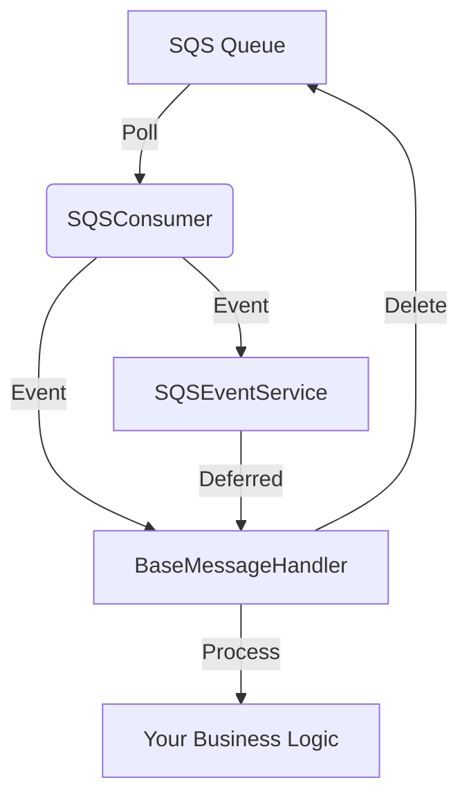

# AWS SQS Consumer Python Library

A robust, asynchronous Python library for consuming and processing messages from AWS SQS queues, designed for scalable, event-driven architectures. Built with `aioboto3` and `pydantic-settings`, it provides a flexible, extensible framework for integrating SQS-based workflows in cloud-native applications.

## Key Features & Benefits

- **Async & Scalable:** Leverages `aioboto3` and async patterns for high-throughput message processing.
- **Pluggable Handlers:** Easily define custom message handlers by subclassing `BaseMessageHandler`.
- **Event-Driven:** Built-in event system for extensibility and decoupled processing.
- **Configurable:** All settings are environment-driven and validated with Pydantic.
- **Production-Ready:** Includes logging, error handling, and concurrency controls.

## Architecture Overview



- **SQSConsumer:** Polls the queue, emits events, manages concurrency.
- **BaseMessageHandler:** Abstract class for your custom logic.
- **SQSEventService:** Event bus for message lifecycle hooks.

## Directory Structure

| Path                                 | Purpose                       |
| ------------------------------------ | ----------------------------- |
| `vmxfp_aws_sqs_consumer/__init__.py` | Main consumer and handler API |
| `vmxfp_aws_sqs_consumer/event.py`    | Event system and types        |
| `vmxfp_aws_sqs_consumer/settings.py` | Pydantic-based config         |
| `tests/`                             | (Placeholder) for tests       |

## Installation

```bash
pnpm nx run <target_project>:add vmxfp-py-aws-sqs-consumer --local
```

**Requirements:**

- Python 3.9+
- aioboto3 >= 14.3.0
- pydantic-settings >= 2.9.1

## Configuration

All settings are loaded from environment variables (with prefix `SQS_CONSUMER_`). Example:

| Variable                                  | Type | Default | Description                      |
| ----------------------------------------- | ---- | ------- | -------------------------------- |
| `SQS_CONSUMER_QUEUE_URL`                  | str  | —       | SQS queue URL                    |
| `SQS_CONSUMER_MAX_NUMBER_OF_MESSAGES`     | int  | 10      | Max messages per poll            |
| `SQS_CONSUMER_VISIBILITY_TIMEOUT`         | int  | 30      | Message visibility timeout (sec) |
| `SQS_CONSUMER_NUMBER_OF_CONCURRENT_TASKS` | int  | 100     | Max concurrent message handlers  |
| `SQS_CONSUMER_WAIT_TIME_SECONDS`          | int  | 1       | Wait time between polls (sec)    |

## Usage Example

Below is a real-world example from a workflow application using this library:

```python
import asyncio
import aioboto3
from dependency_injector.wiring import Provide, inject
from temporalio.client import Client
from vmxfp_aws_sqs_consumer import BaseMessageHandler, SQSConsumer
from .containers import Container

class IncomingMessageHandler(BaseMessageHandler):
    @inject
    def __init__(
        self,
        queue_url: str,
        temporal_client: Client,
        aioboto3_session: aioboto3.Session = Provide[Container.aioboto3_session],
    ):
        super().__init__(queue_url, aioboto3_session)
        self._temporal_client = temporal_client

    async def _handle(self, message: dict):
        # Your business logic here
        ...

async def main():
    container = Container()
    await container.init_resources()
    container.wire(modules=[__name__])

    sqs_consumer_settings = container.sqs_consumer_settings()
    handler = IncomingMessageHandler(
        queue_url=sqs_consumer_settings.queue_url,
        temporal_client=await container.temporal_client(),
    )
    consumer = SQSConsumer(
        sqs_consumer_settings=sqs_consumer_settings,
        message_handler=handler.handle,
        aioboto3_session=container.aioboto3_session(),
    )
    await consumer.run()
    await container.shutdown_resources()

if __name__ == "__main__":
    asyncio.run(main())
```

## Extending & Events

- Subscribe to events using `SQSEventService` for custom hooks (e.g., logging, metrics).
- Implement your own handler by subclassing `BaseMessageHandler`.
