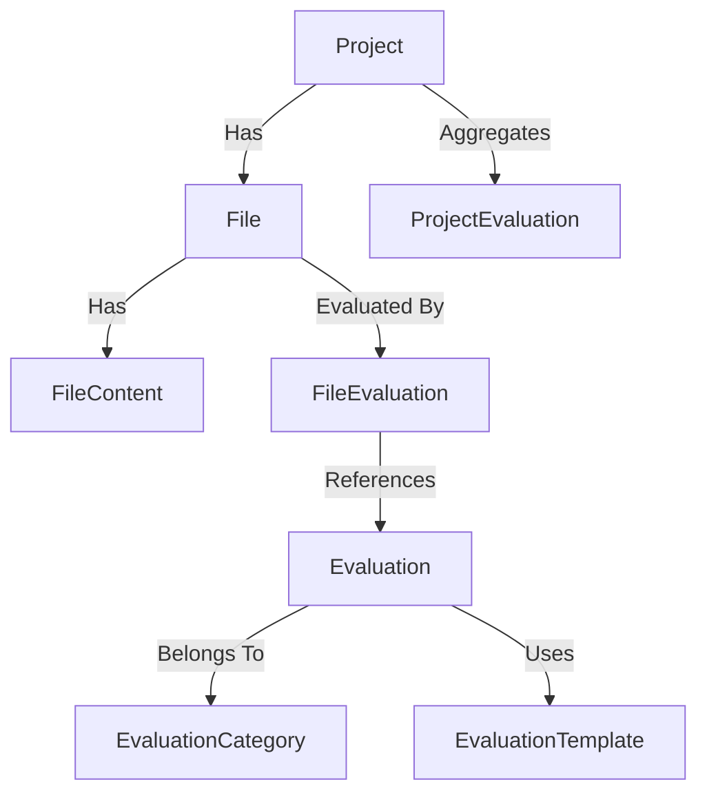

# Database Models Python Library

A comprehensive set of SQLModel-based database models for managing projects, files, evaluations, and related entities in a modular, cloud-native workflow platform. Designed for extensibility, analytics, and seamless integration with modern Python data and service layers.

## Key Features & Benefits

- **Rich Data Models:** Covers projects, files, evaluations, embeddings, and more.
- **SQLModel & SQLAlchemy:** Leverages modern Python ORM for async and sync DB access.
- **Extensible:** Easily add new models or fields for evolving requirements.
- **Analytics-Ready:** Includes stats and status fields for workflow tracking.
- **Typed & Validated:** Strong typing and validation for robust data handling.

## Architecture Overview



- **Project:** Top-level entity for grouping files and evaluations.
- **File:** Represents an uploaded or processed file.
- **Evaluation:** Defines a metric or prompt for file/project assessment.
- **FileEvaluation:** Links files to evaluations and stores results.
- **Embeddings/Content:** Support for chunked file content and vector embeddings.

## Directory Structure

| Path                                     | Purpose                        |
| ---------------------------------------- | ------------------------------ |
| `vmxfp_db_models/file.py`                | File and FileEvaluation models |
| `vmxfp_db_models/project.py`             | Project and ProjectEvaluation  |
| `vmxfp_db_models/evaluation.py`          | Evaluation models              |
| `vmxfp_db_models/evaluation_category.py` | Evaluation category models     |
| `vmxfp_db_models/evaluation_template.py` | Evaluation template models     |
| `vmxfp_db_models/file_content.py`        | File content chunking          |
| `vmxfp_db_models/file_embedding.py`      | Embedding/vector models        |
| `vmxfp_db_models/session_manager.py`     | Session management             |
| `tests/`                                 | (Placeholder) for tests        |

## Installation

```bash
pnpm nx run <target_project>:add vmxfp-py-db-models --local
```

## Main Models Overview

| Model                | Description                              |
| -------------------- | ---------------------------------------- |
| `Project`            | Workflow/project grouping                |
| `File`               | Uploaded or processed file               |
| `Evaluation`         | Metric or prompt for assessment          |
| `FileEvaluation`     | Result of evaluating a file              |
| `FileContent`        | Chunked file content                     |
| `FileEmbedding`      | Vector embedding for file/content        |
| `EvaluationCategory` | Category for organizing evaluations      |
| `EvaluationTemplate` | Template for reusable evaluation configs |
