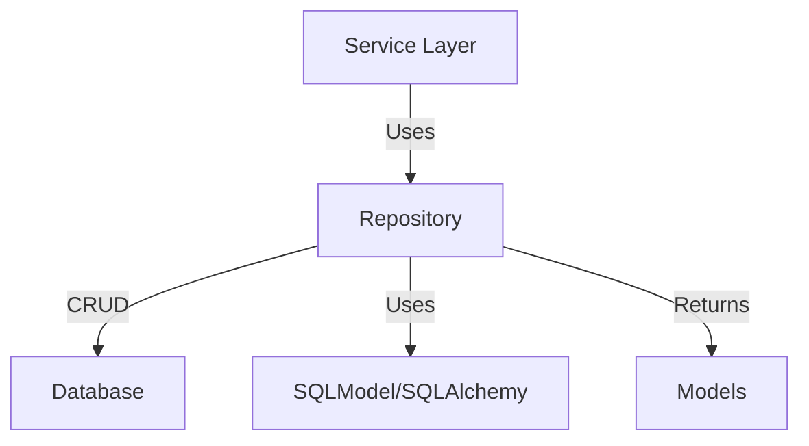

# Database Repositories Python Library

A modular set of repository classes for managing database access and business logic in a scalable, async Python backend for workflow and data processing. Built on top of SQLModel and SQLAlchemy, these repositories provide async CRUD operations, advanced search, and integration with dependency injection for robust, testable data access layers.

## Key Features & Benefits

- **Async CRUD Operations:** Unified interface for create, read, update, and delete.
- **Advanced Search:** Support for complex queries and filtering.
- **Extensible:** Easily add new repositories for new models.
- **Dependency Injection Ready:** Integrates with DI containers for scalable apps.
- **Separation of Concerns:** Keeps business logic out of models and services.

## Architecture Overview

- **Repositories:** Encapsulate all DB access and logic for each entity.
- **Service Layer:** Calls repositories for data operations.
- **Models:** Typed data returned from repositories.

## BaseRepository: Foundation for All Repositories

The `BaseRepository` is an abstract, generic class that provides a consistent, async interface for CRUD operations on any SQLModel-based entity. All concrete repositories inherit from this class.

### Purpose

- Eliminate boilerplate for common DB operations
- Enforce a consistent, testable pattern for all repositories
- Support both single and composite primary keys

### Key Features

- **Generic Typing:** Works with any model, read model, and create model
- **Async Operations:** All methods are async for scalable, non-blocking access
- **Session Factories:** Accepts factories for read/write DB sessions
- **Bulk Operations:** Efficient batch inserts with chunking
- **Extensible:** Requires concrete repositories to define ID logic

### Main Methods

| Method               | Description                                   |
| -------------------- | --------------------------------------------- |
| `get_all()`          | Retrieve all records (with optional ordering) |
| `get(id)`            | Retrieve a single record by ID                |
| `get_many(ids)`      | Retrieve multiple records by a list of IDs    |
| `add(model)`         | Insert a new record                           |
| `add_all(models)`    | Bulk insert multiple records                  |
| `update(id, values)` | Update a record by ID                         |
| `delete(id)`         | Delete a record by ID                         |

#### Abstract Methods (to be implemented by each repository)

- `_id_fields`: Specify which columns are used as the primary key(s)
- `_id_predicate(id)`: Generate a SQLAlchemy predicate for filtering by ID

## Directory Structure

| Path                     | Purpose                        |
| ------------------------ | ------------------------------ |
| `base.py`                | Abstract base repository       |
| `file.py`                | File repository                |
| `file_embedding.py`      | Embedding repository           |
| `file_content.py`        | File content repository        |
| `file_evaluation.py`     | File evaluation repository     |
| `project.py`             | Project repository             |
| `evaluation.py`          | Evaluation repository          |
| `evaluation_category.py` | Evaluation category repository |
| `evaluation_template.py` | Evaluation template repository |
| `containers.py`          | DI container for repositories  |

## Main Repositories Overview

| Repository                     | Description                     |
| ------------------------------ | ------------------------------- |
| `FileRepository`               | CRUD and search for files       |
| `FileEmbeddingRepository`      | Manage file embeddings          |
| `FileContentRepository`        | Manage file content chunks      |
| `FileEvaluationRepository`     | Manage file evaluation results  |
| `ProjectRepository`            | CRUD for projects               |
| `EvaluationRepository`         | CRUD for evaluation definitions |
| `EvaluationCategoryRepository` | CRUD for evaluation categories  |
| `EvaluationTemplateRepository` | CRUD for evaluation templates   |
