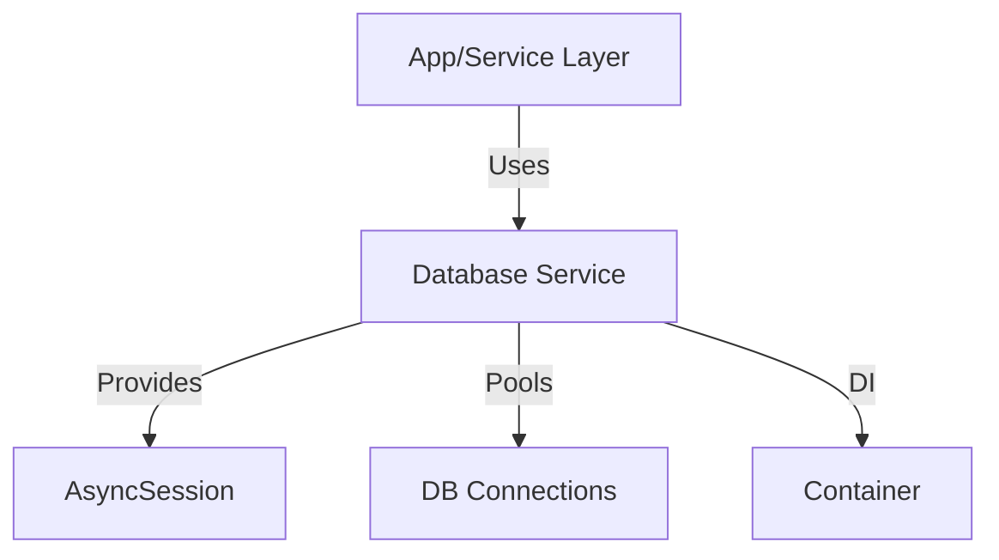

# Database Services Python Library

A foundational library for managing asynchronous database connections and session lifecycles in a modular, scalable Python backend for workflow and data processing. Provides robust, dependency-injection-ready database services for use with SQLModel and SQLAlchemy.

## Key Features & Benefits

- **Async Session Management:** Provides async context-managed sessions for both read and write operations.
- **Connection Pooling:** Efficient pooling and resource management for high-throughput applications.
- **Read/Write Separation:** Supports separate engines for read and write workloads.
- **Dependency Injection Ready:** Integrates with DI containers for scalable, testable apps.
- **Error Handling:** Automatic rollback and cleanup on exceptions.

## Architecture Overview

- **Database Service:** Manages engine, session factories, and pooling.
- **DI Container:** Provides singleton access to configured database service.

## Database Class: Async Database Management

The `Database` class encapsulates all logic for creating, pooling, and managing async database sessions. It supports both read-only and write sessions, with context-managed access and robust error handling.

### Main Features

- **Async Engines:** Separate async engines for read and write DB access
- **Session Factories:** Scoped session factories for both read and write
- **Context Managers:** `session()` and `writer_session()` yield `AsyncSession` objects
- **Automatic Rollback:** On exception, sessions are rolled back and closed
- **Shutdown:** Cleanly disposes of all engines and resources

### Dependency Injection

- The `DatabaseContainer` (using `dependency_injector`) provides a singleton `Database` instance, configured from environment or settings.

## Directory Structure

| Path            | Purpose                     |
| --------------- | --------------------------- |
| `database.py`   | Main async database service |
| `containers.py` | DI container for database   |
| `__init__.py`   | Package init                |

## Main Services Overview

| Service/Class       | Description                       |
| ------------------- | --------------------------------- |
| `Database`          | Async DB engine/session manager   |
| `DatabaseContainer` | DI container for database service |
