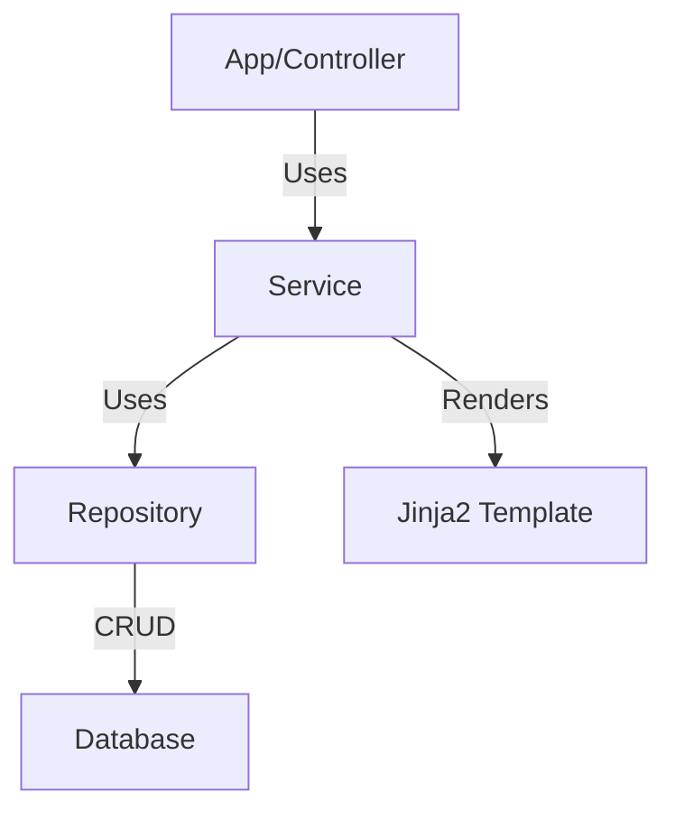

# Application Services Python Library

A collection of high-level, reusable service classes for orchestrating business logic and workflows in a modular, async Python backend. These services encapsulate domain logic, integrate with repositories, and are designed for use with dependency injection.

## Key Features & Benefits

- **Business Logic Encapsulation:** Keeps domain logic out of controllers and models.
- **Async Operations:** All service methods are async for scalable, non-blocking workflows.
- **Template Support:** Dynamic prompt and system prompt rendering using Jinja2.
- **Repository Integration:** Services use repositories for all data access.
- **Dependency Injection Ready:** Integrates with DI containers for scalable, testable apps.

## Architecture Overview

- **Services:** Orchestrate business logic and workflow steps.
- **Repositories:** Handle all DB access and queries.
- **Templates:** Used for dynamic prompt generation.

## EvaluationService: Dynamic Evaluation Logic

The `EvaluationService` provides async methods for retrieving and rendering evaluation objects, including dynamic prompt and system prompt generation using Jinja2 templates. It integrates with both evaluation and template repositories, and is designed for use with dependency injection.

### Main Features

- **Dynamic Prompt Rendering:** Uses Jinja2 to render prompts from templates and evaluation data
- **Async Data Access:** All methods are async and use repositories for DB access
- **DI Integration:** Provided as a factory in the `ServicesContainer` for easy injection

## Directory Structure

| Path            | Purpose                   |
| --------------- | ------------------------- |
| `evaluation.py` | Evaluation service logic  |
| `containers.py` | DI container for services |
| `__init__.py`   | Package init              |

## Main Services Overview

| Service/Class       | Description                           |
| ------------------- | ------------------------------------- |
| `EvaluationService` | Async business logic for evaluations  |
| `ServicesContainer` | DI container for application services |
