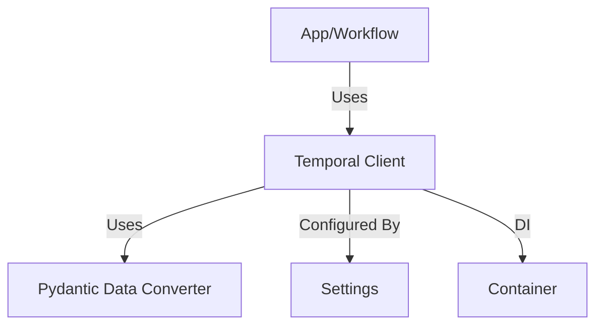

# Temporal Utilities Python Library

A set of utilities for integrating Python applications with Temporal workflows, featuring advanced Pydantic-based data conversion, async client initialization, and dependency injection support. Designed for robust, type-safe, and scalable workflow orchestration.

## Key Features & Benefits

- **Pydantic Data Conversion:** Serialize and deserialize workflow payloads using Pydantic models for type safety and flexibility.
- **Async Client Initialization:** Easily create and configure Temporal clients for async workflow execution.
- **Dependency Injection Ready:** Integrates with DI containers for scalable, testable apps.
- **Configurable:** Settings loaded from environment variables using Pydantic.

## Architecture Overview

- **Temporal Client:** Connects to Temporal server with custom data conversion.
- **Pydantic Data Converter:** Handles serialization/deserialization of workflow payloads.
- **DI Container:** Provides configured client and settings.

## Pydantic Data Converter & Client Initialization

- **Pydantic Data Converter:** Custom payload converter for Temporal, supporting all Pydantic-compatible types and models. Ensures type-safe, JSON-based serialization for workflow inputs/outputs.
- **Client Initialization:** Async function to connect to Temporal using the custom data converter, yielding a ready-to-use client.
- **Settings:** Pydantic-based configuration for Temporal host and environment.
- **Dependency Injection:** The `TemporalContainer` provides singleton settings and a resource-managed Temporal client for use throughout your application.

## Directory Structure

| Path                    | Purpose                               |
| ----------------------- | ------------------------------------- |
| `client.py`             | Async Temporal client initialization  |
| `pydantic_converter.py` | Pydantic-based data converter         |
| `settings.py`           | Pydantic settings for Temporal config |
| `containers.py`         | DI container for Temporal utilities   |
| `__init__.py`           | Package init                          |

## Main Utilities Overview

| Utility/Class             | Description                           |
| ------------------------- | ------------------------------------- |
| `pydantic_data_converter` | Pydantic-based payload converter      |
| `init_temporal_client`    | Async Temporal client initialization  |
| `TemporalSettings`        | Pydantic settings for Temporal config |
| `TemporalContainer`       | DI container for Temporal utilities   |
