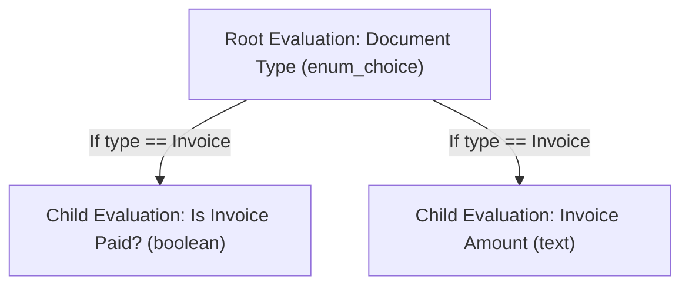

# Evaluation Workflow (Temporal)

This package implements a sophisticated, multi-step evaluation pipeline using Temporal workflows and activities. It is designed to evaluate files (e.g., documents) using various evaluation types (boolean, enum, text), supports hierarchical/recursive evaluations, and integrates with LLMs and external services.

## How the Workflow is Started

- **Event-Driven Trigger:** The evaluation workflow is triggered by the `file_ingested_successfully` event, which is emitted by the ingestion workflow after a file has been successfully processed.
- **Infrastructure Pattern:**
  1. **EventBridge Event Bus:** A shared AWS EventBridge event bus (`<resource-prefix>-event-bus-<stage>`) receives events from the ingestion workflow.
  2. **EventBridge Rule:** A rule listens for events with `detailType: 'file_ingested_successfully'` and targets the evaluation SQS queue.
  3. **SQS Queue:** The rule delivers the event's detail payload to the SQS queue (`<resource-prefix>-evaluation-workflow-<region>-<stage>`).
  4. **EKS Service Account:** The evaluation workflow container runs in EKS with a service account that has permission to consume messages from the SQS queue.
  5. **Long Polling:** The evaluation container long-polls the SQS queue for new messages.
  6. **Workflow Start:** When a message is received, the container starts the `EvaluationWorkflow` via the Temporal API, passing the event payload.
- This pattern ensures reliable, decoupled, and scalable evaluation of files as soon as they are ingested, leveraging AWS EventBridge, SQS, and EKS for robust event-driven orchestration.

## Overview

- **Workflow Steps:**
  1. **Start Evaluations:** For a given file, retrieves evaluation definitions for the project, constructs requests, and sends them to an LLM service (via VMXClient). Supports different evaluation types and tool choices.
  2. **Signal Handling & Result Storage:** Receives signals as evaluation results are returned asynchronously. Stores evaluation outcomes, LLM request/response, and status in the database. Handles recursive/hierarchical evaluations by triggering further evaluations based on results.
  3. **Update File Status:** Marks the file as `COMPLETED` or `FAILED` in the database.

## Activities

- `StartEvaluationsActivity`: Orchestrates creation and submission of evaluation requests to the LLM service, handling tool selection and metadata.
- `StoreEvaluationActivity`: Stores evaluation results, including LLM request/response, in the database.
- `GetFilesToEvaluateActivity`: Determines which files need to be evaluated, supporting parent/child evaluation relationships.
- Shared: `UpdateFileStatusActivity` (from shared-activities package).

## Error Handling

- Retries activities up to 3 times.
- On failure, updates file status and raises a Temporal application error.

## Database Models

### File

| Field         | Type     | Description                                                                                             |
| ------------- | -------- | ------------------------------------------------------------------------------------------------------- |
| id            | UUID     | Unique identifier for the file                                                                          |
| name          | str      | File name                                                                                               |
| type          | str      | MIME type                                                                                               |
| size          | int      | File size in bytes                                                                                      |
| url           | str      | S3 URL of the file                                                                                      |
| status        | enum     | File status (pending, chunking, chunked, embedding, embedded, evaluating, evaluated, completed, failed) |
| error         | str/null | Error message, if any                                                                                   |
| project_id    | UUID     | Associated project                                                                                      |
| thumbnail_url | str/null | S3 URL of the file thumbnail                                                                            |
| created_at    | datetime | Creation timestamp                                                                                      |
| updated_at    | datetime | Last update timestamp                                                                                   |

### FileContent

| Field            | Type     | Description                                  |
| ---------------- | -------- | -------------------------------------------- |
| id               | UUID     | Unique identifier for the file content chunk |
| file_id          | UUID     | Associated file                              |
| content_number   | int      | Chunk/page number                            |
| content_metadata | dict     | Metadata for the chunk (JSON)                |
| content          | str      | Text content of the chunk                    |
| created_at       | datetime | Creation timestamp                           |
| updated_at       | datetime | Last update timestamp                        |

### Evaluation

| Field                    | Type           | Description                                                |
| ------------------------ | -------------- | ---------------------------------------------------------- |
| id                       | UUID           | Unique identifier for the evaluation definition            |
| title                    | str            | Human-friendly title for the evaluation                    |
| description              | str            | Detailed description of what is being evaluated            |
| system_prompt            | str/null       | System prompt for LLMs (optional)                          |
| prompt                   | str            | Prompt/question to be evaluated                            |
| project_id               | UUID           | Associated project                                         |
| evaluation_type          | enum           | Type of evaluation (see below)                             |
| evaluation_options       | list[str]/null | Options for enum_choice evaluations (if applicable)        |
| parent_evaluation_id     | UUID/null      | Parent evaluation for hierarchical/conditional evaluations |
| parent_evaluation_option | str/null       | Option in parent evaluation that triggers this evaluation  |
| category_id              | UUID           | Category/grouping for the evaluation                       |
| template_id              | UUID/null      | Associated evaluation template (if any)                    |
| created_at               | datetime       | Creation timestamp                                         |
| updated_at               | datetime       | Last update timestamp                                      |

### FileEvaluation

| Field         | Type      | Description                                                |
| ------------- | --------- | ---------------------------------------------------------- |
| id            | UUID      | Unique identifier for the evaluation result                |
| file_id       | UUID      | Associated file                                            |
| evaluation_id | UUID      | Associated evaluation definition                           |
| content_id    | UUID      | Associated file content chunk                              |
| response      | str       | Evaluation response/result                                 |
| status        | enum      | Evaluation status (pending, processing, completed, failed) |
| error         | str/null  | Error message, if any                                      |
| llm_request   | dict/null | LLM request payload (JSON)                                 |
| llm_response  | dict/null | LLM response payload (JSON)                                |
| created_at    | datetime  | Creation timestamp                                         |
| updated_at    | datetime  | Last update timestamp                                      |

#### Relationship: Evaluation and FileEvaluation

- **Evaluation** defines the criteria, prompt, and type of evaluation (e.g., "Does this document contain sensitive information?").
- **FileEvaluation** records the result of applying an Evaluation to a specific file (and optionally a specific chunk of content).
- One Evaluation can have many FileEvaluations (one per file/chunk evaluated).
- FileEvaluation links to both the Evaluation definition and the specific file/content being evaluated.

## Evaluation Types

| Type        | Description                                                  | Example Use Case                                               |
| ----------- | ------------------------------------------------------------ | -------------------------------------------------------------- |
| enum_choice | The evaluator must select from a predefined list of options. | "What is the document type?" (e.g., Invoice, Report, Contract) |
| text        | The evaluator provides a free-form text answer.              | "Summarize the main topic of this document."                   |
| boolean     | The evaluator answers yes/no (true/false).                   | "Does this file contain personal data?"                        |

- The evaluation type determines how the prompt is presented and how responses are validated/stored.
- Enum choices are defined in `evaluation_options` for enum_choice evaluations.
- Hierarchical evaluations can be created by linking evaluations via `parent_evaluation_id` and `parent_evaluation_option`.

## Hierarchical (Parent/Child) Evaluations

- Evaluations can be organized in a parent/child hierarchy using the `parent_evaluation_id` and `parent_evaluation_option` fields.
- This allows conditional or follow-up questions based on previous answers.

**Example:**

- Root Evaluation: "What is the document type?" (enum_choice: Invoice, Report, Contract)
- Child Evaluation: "Is Invoice Paid?" (boolean), only if the document type is Invoice
- Child Evaluation: "Invoice Amount" (text), only if the document type is Invoice

**Tree Representation:**



This structure enables complex, context-aware evaluation flows, where follow-up questions depend on earlier answers.

## Extensibility

- Supports new evaluation types, custom tool integrations, and recursive evaluation logic.
- Modular activities and workflow steps for easy extension.

## Usage

This example is intended for learning and as a template for your own Temporal evaluation workflows.

### Run Locally

```bash
pnpm nx run workflow-evaluation:serve
```

### Build

```bash
pnpm nx build workflow-evaluation
```

### Test

```bash
pnpm nx test workflow-evaluation
```

## Project Structure

- `evaluation_workflow/`: Workflow and activity implementations
- `activities/`: Temporal activities for each workflow step
- `tests/`: Unit and integration tests

## Requirements

- Python 3.9+
- Nx and pnpm installed
- Temporal server (local or cloud)
- LLM service credentials (for VMXClient)

## Integration with VM-X AI Routing Platform

This workflow integrates with [VM-X](https://vm-x.ai/), a platform that provides advanced routing and management for AI workloads. VM-X enables you to manage allocation, routing, fallback, and security for AI tasks, ensuring robust and scalable AI operations.

**How it works in this workflow:**

- **Batching and Queueing:** Evaluation requests are batched and sent to VM-X, which processes them in a queue-based manner. This allows for efficient handling of large numbers of evaluation tasks and supports high-throughput scenarios.
- **Callback Mechanism:** Once VM-X completes or fails a task, it issues an HTTP callback to the API (see [`ingest_callback.py`](../../apps/api/api/routes/ingest_callback.py)). The callback endpoint updates the corresponding Temporal workflow, signaling the result of the evaluation.
- **Benefits:**
  - Decouples evaluation execution from workflow orchestration
  - Enables robust retry, fallback, and security policies for AI tasks
  - Scales to handle large volumes of concurrent evaluation requests

For more details on VM-X, see the [official website](https://vm-x.ai/).
