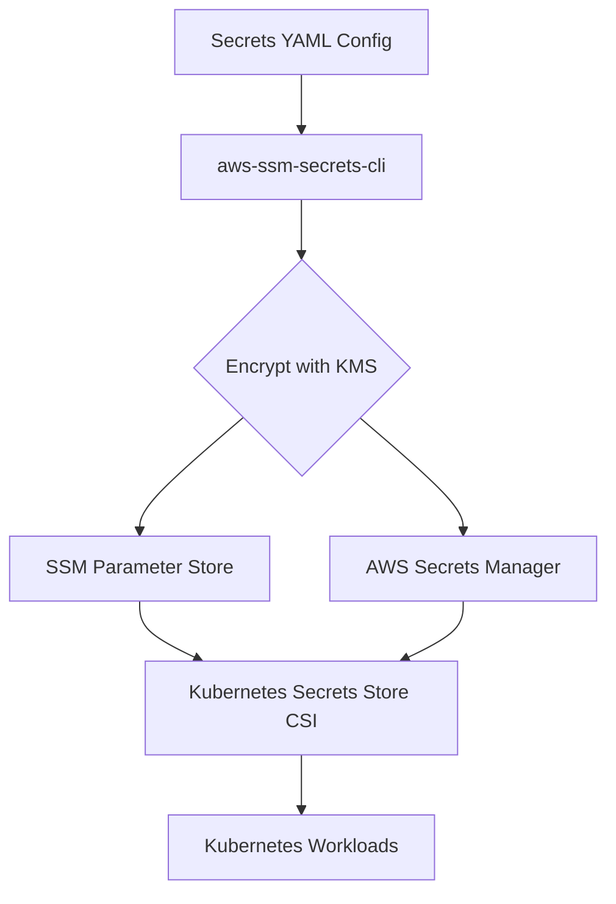

# Secrets Management Infrastructure Module

This module provides secure, automated, and scalable secrets management for cloud-native environments using AWS KMS, SSM Parameter Store, and AWS Secrets Manager. It is designed to keep sensitive configuration out of your git repository while enabling GitOps and infrastructure-as-code workflows.

---

## Overview

- **Purpose:** Manage secrets and sensitive configuration as code, securely and consistently across environments.
- **Foundation:** Built on top of the [aws-ssm-secrets-cli](https://pypi.org/project/aws-ssm-secrets-cli/) Python library.
- **Integrations:** Works with Kubernetes via the Secrets Store CSI driver.

---

## Motivation

Managing secrets across multiple AWS environments is complex. CloudFormation does not natively support SSM SecureString parameters, and storing secrets in git is insecure. This module solves these problems by:

- Encrypting secrets with KMS before storing or deploying.
- Managing secrets as code in YAML files.
- Enabling only authorized users (with KMS access) to decrypt or deploy secrets.

---

## Features

- Store secrets in SSM Parameter Store (SecureString) or AWS Secrets Manager
- Encrypt/decrypt secrets locally using AWS KMS or AWS Encryption SDK
- Manage secrets for multiple environments using YAML config files (e.g., `dev.yaml`)
- Deploy secrets to AWS with a single command
- Advanced features: CloudFormation output references, shell command values, global tagging
- Integrates with Kubernetes via the Secrets Store CSI driver

---

## Architecture



---

## Workflow

1. **Define secrets in YAML**
   - Specify secrets and parameters, referencing the KMS key ARN.
2. **Encrypt secrets**
   - Encrypt secrets locally before committing to git.
3. **Deploy secrets**
   - Deploy encrypted secrets to AWS SSM or Secrets Manager.
4. **Sync to Kubernetes**
   - Secrets are synced into Kubernetes using the Secrets Store CSI driver.

### Example YAML

```yaml
kms:
  arn: arn:aws:kms:us-east-1:123456789012:key/abcd-1234-efgh-5678
parameters:
  - name: /my/secure/param
    value: 'MySecretValue'
    type: SecureString
secrets:
  - name: my-app-secret
    value:
      username: myuser
      password: mypassword
```

### Example Commands

- **Encrypt:**
  ```sh
  aws-secrets encrypt -e dev.yaml --profile myprofile --region us-east-1
  ```
- **Deploy:**
  ```sh
  aws-secrets deploy -e dev.yaml --profile myprofile --region us-east-1
  ```

---

## Security

- All secrets are encrypted with KMS before being stored or deployed.
- Only users with access to the KMS key can decrypt or deploy secrets.
- Secrets are never stored in plaintext in git or CI/CD pipelines.

---

## Requirements

- AWS account
- Node.js & pnpm (for development)
- AWS CLI (for cloud deployments)

---

## Usage

1. Add this module as a dependency in your infrastructure project.
2. Define secrets and access policies as code.
3. Deploy using your preferred IaC tool.

---

## Project Structure

```text
secrets/
├── src/                # Source code for secrets management constructs
├── package.json        # Package metadata
├── tsconfig.json       # TypeScript config
└── ...
```

---

## References

- [aws-ssm-secrets-cli PyPI](https://pypi.org/project/aws-ssm-secrets-cli/)
- [AWS Encryption SDK Documentation](https://docs.aws.amazon.com/encryption-sdk/latest/developer-guide/introduction.html)

---

## Community

Security is a top priority. Please report vulnerabilities responsibly. Contributions are welcome for new features and improvements.
