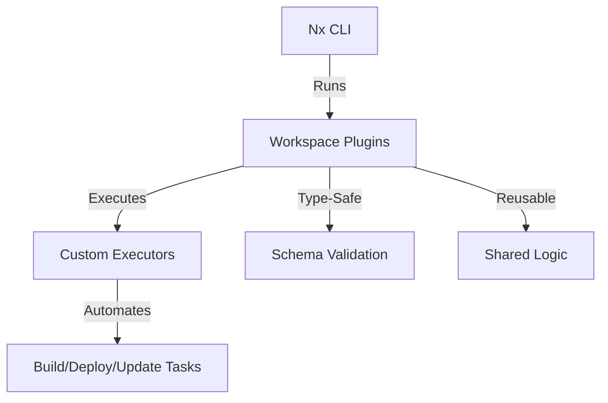

# Workspace Plugins

A modular Nx plugin library providing custom executors for advanced build, deployment, and automation workflows across the monorepo. Designed for extensibility and seamless integration with Nx-powered projects.

## Key Features & Benefits

- **Custom Executors:** Extend Nx with project-specific build, deployment, and automation logic
- **Reusable Automation:** Centralize and reuse build/deploy logic across multiple projects
- **Type-Safe:** Written in TypeScript with schema validation for executor options
- **Integration:** Works with Nx, Node.js, and common monorepo patterns

## Architecture Overview



- **Nx CLI:** Orchestrates tasks and invokes custom executors
- **Workspace Plugins:** Houses all custom executors and shared logic
- **Executors:** Implement build, deploy, and YAML update automation
- **Schema Validation:** Ensures type safety and correct usage

## Directory Structure

| Path             | Purpose                   |
| ---------------- | ------------------------- |
| `src/`           | Source code for executors |
| `executors.json` | Executor registration     |
| `package.json`   | Project configuration     |
| `dist/`          | Compiled output (build)   |

## Main Executors Overview

| Executor Name    | Description                             |
| ---------------- | --------------------------------------- |
| `nest-build`     | Build NestJS projects with custom logic |
| `proxy-executor` | Proxy execution to another target       |
| `update-yaml`    | Update YAML files programmatically      |

## Usage

- Add as a dependency in your Nx workspace
- Reference executors in your `project.json` targets:

```json
{
  "targets": {
    "build": {
      "executor": "@workspace/workspace-plugins:nest-build",
      "options": {
        /* ... */
      }
    }
  }
}
```

## Building

Run `nx build workspace-plugins` to build the library.

## Running unit tests

Run `nx test workspace-plugins` to execute the unit tests via [Vitest](https://vitest.dev/).
